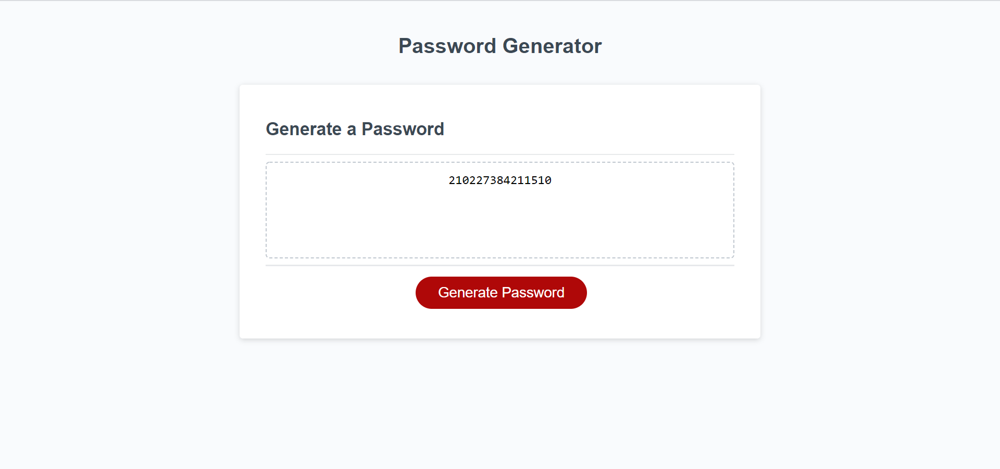

# hw-week-three

## Description
This project is a simple password generator using a simple HTML/CSS interface and powered by JavaScript, this generator can create passwords 8-128 characters in length and provide character types of lowercase, uppercase, numeric, and special. The purpose of this application is to gain familiartiy with various aspects of JavaScript, and to provide a real-world app to generate simple passwords.

Live deployment of this project can be viewed at: https://jaymanw.github.io/hw-week-three/
